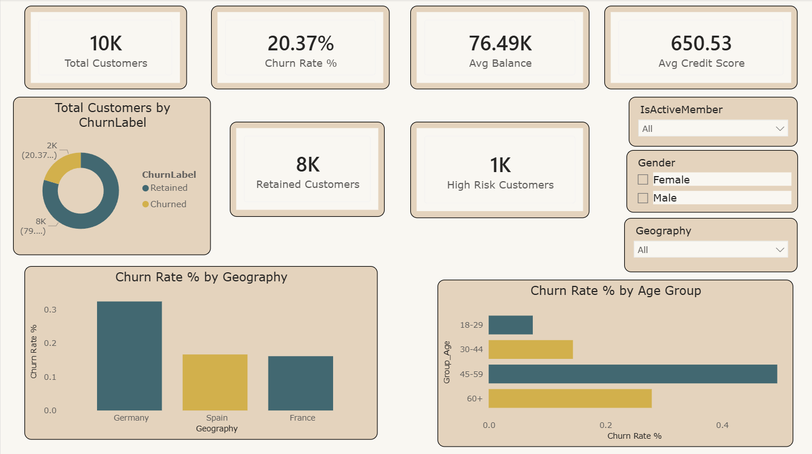
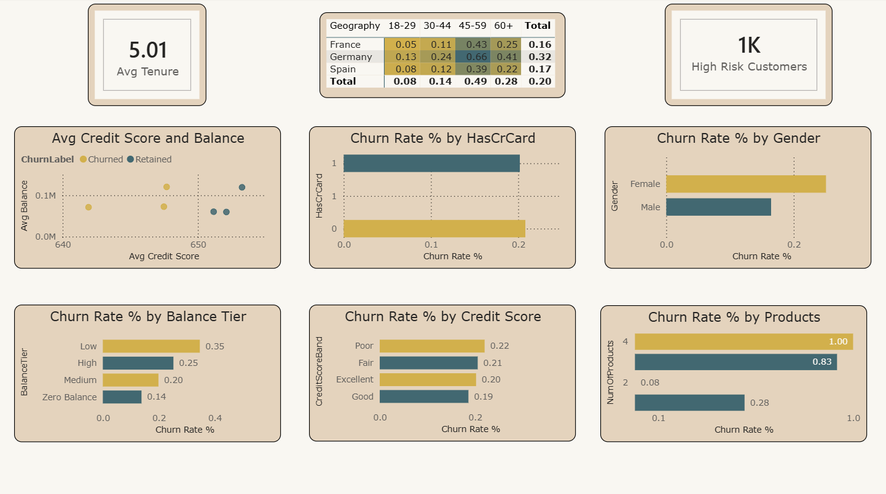
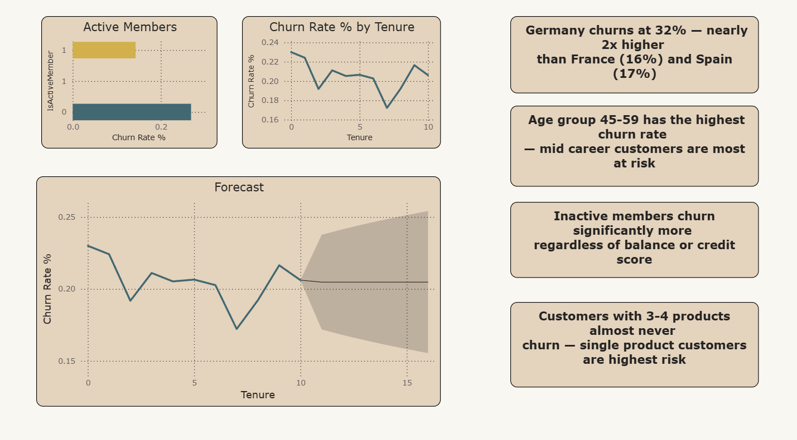

# Banking Customer Churn Analysis Dashboard

## Overview
Interactive Power BI dashboard designed to analyze customer churn behavior, retention trends, risk segmentation, and financial insights in the banking sector. The dashboard helps identify high-risk customers and supports data-driven decision-making through forecasting and analytical visualizations.

## Tools Used
- Power BI
- DAX
- Power Query
- Excel / CSV
- Data Visualization
- Forecasting Techniques

## Features
- KPI Cards
- Customer Churn Analysis
- High-Risk Customer Identification
- Geography-wise Churn Analysis
- Age Group & Gender Analysis
- Credit Score & Balance Analysis
- Forecasting & Trend Visualization
- Interactive Filters & Slicers
- Business Insights & Risk Segmentation

# Visualization Preview

## Key Insights
- Germany showed the highest churn rate at 32%
- Customers aged 45–59 had the highest churn probability
- Inactive members churned significantly more than active members
- Customers with fewer banking products were more likely to churn
- Forecasting analysis highlighted future churn trends and risk patterns

## Project Files
- Churn Analysis.pbix

# Author
Ubaid Sindhi
